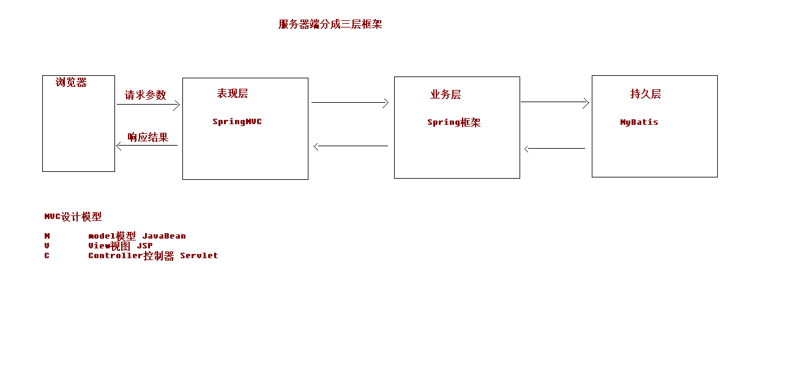
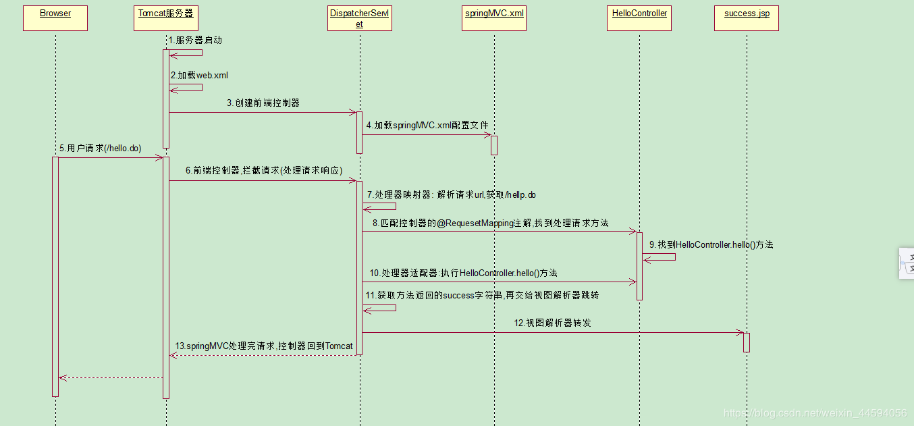
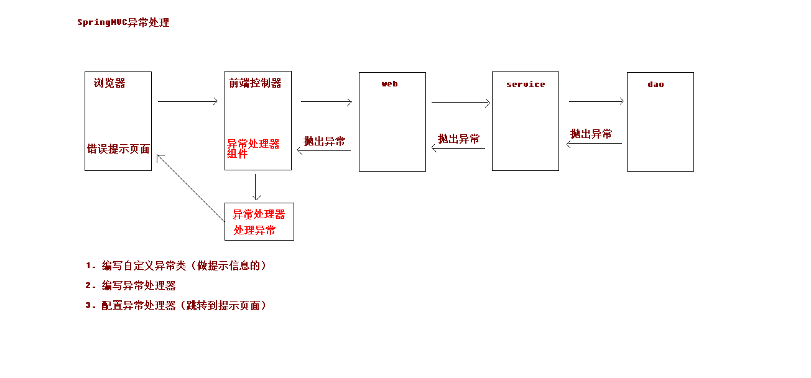

# Spring MVC 的学习文档
**此处到各类注解的含义示例代码在springmvc_quick_start项目**
## Spring MVC 的概念
SpringMVC 是一种基于 Java 的实现 MVC 设计模型的请求驱动类型的轻量级 **Web 框架 （位于 '表现层' 的框架）**，属于 SpringFrameWork 的后续产品，已经融合在 Spring Web Flow 里面。   
Spring 框架提供了构建 Web 应用程序的全功能 MVC 模块。使用 Spring 可插入的 MVC 架构，从而在使用 Spring 进行 WEB 开发时，可以选择使用 Spring的 Spring MVC 框架或集成其他 MVC 开发框架，如 Struts1(现在一般不用)，Struts2 等。
SpringMVC 已经成为目前最主流的 MVC 框架之一，并且随着 Spring3.0 的发布，全面超越 Struts2，成为最优秀的 MVC 框架。
它通过一套注解，让一个简单的 Java 类成为处理请求的**控制器**，而无须实现任何接口。同时它还支持RESTful 编程风格的请求。


## Spring MVC使用demo
### 访问的步骤

**参与对象描述:**
1. browse : 用户浏览器
2. Tomcat : 搭载web应用的服务器
3. DispatcherServlet : 是 Spring MVC 的心脏，它负责接收 HTTP 请求并协调 SpringMVC 的各个组件完成请求处理的工作
4. springMVC.xml : springMVC的配置文件
5. HelloController : 应用程序中处理程序交互的部分.作用一般就是处理程序逻辑的
6. success.jsp : 展示数据的视图,在顺序图中表示处理成功的响应
### 步骤的分析
1. web服务器tomcat启动
2. 启动后自动加载web.xml配置文件
3. 创建前端控制器（web.xml中配置的）dispatcherServlet
**具体代码：**

        ```xml
            <servlet>
                <servlet-name>dispatcherServlet</servlet-name>
                <servlet-class>org.springframework.web.servlet.DispatcherServlet</servlet-class>
            </servlet>
            <servlet-mapping><!--配置servlet-mapping,通过url找到servlet-->
                <servlet-name>dispatcherServlet</servlet-name>
                <!--
                    <url-pattern>*.do</url-pattern>  根据后缀来找
                    <url-pattern>/</url-pattern> 所有url都会让这个前端控制器解析
                    <url-pattern>/*do</url-pattern>有错误，不能这样配置
                -->
                <url-pattern>/</url-pattern><!--拦截的请求，/表示拦截所有-->
            </servlet-mapping>
        ```
4. 在web.xml中dispatcherServlet配置了启动项init-param，去指定项目启动时加载springmvc.xml文件
**具体代码：**

        ```xml
            <servlet>
                <servlet-name>dispatcherServlet</servlet-name>
                <servlet-class>org.springframework.web.servlet.DispatcherServlet</servlet-class>
                <!-- 指定加载springmvc.xml文件 -->
                <init-param>
                <param-name>contextConfigLocation</param-name>
                <param-value>classpath:springmvc.xml</param-value>
                </init-param>
                <!-- 启动时候加载 -->
                <load-on-startup>1</load-on-startup>
            </servlet>
            <servlet-mapping><!--配置servlet-mapping,通过url找到servlet-->
                <servlet-name>dispatcherServlet</servlet-name>
                <url-pattern>/</url-pattern><!--拦截的请求，/表示拦截所有-->
            </servlet-mapping>
        ```
    在springmvc.xml中配置开启注解扫描。
**springmvc具体代码**

        ```xml
            <?xml version="1.0" encoding="UTF-8"?>
            <beans xmlns="http://www.springframework.org/schema/beans"
            xmlns:mvc="http://www.springframework.org/schema/mvc"
            xmlns:context="http://www.springframework.org/schema/context"
            xmlns:xsi="http://www.w3.org/2001/XMLSchema-instance"
            xsi:schemaLocation="
                http://www.springframework.org/schema/beans
                http://www.springframework.org/schema/beans/spring-beans.xsd
                http://www.springframework.org/schema/mvc
                http://www.springframework.org/schema/mvc/spring-mvc.xsd
                http://www.springframework.org/schema/context
                http://www.springframework.org/schema/context/spring-context.xsd">

            <!--开启注解扫描-->
            <context:component-scan base-package="com.mycode.controller"></context:component-scan>
            <!--视图解析器-->
            <bean id="internalResourceViewResolver" class="org.springframework.web.servlet.view.InternalResourceViewResolver">
                <property name="prefix" value="/WEB-INF/pages/"/>  <!--文件所在的目录-->
                <property name="suffix" value=".jsp"/>   <!--文件的后缀名-->
            </bean>
            <!--开启SpringMVC框架注解的支持-->
            <mvc:annotation-driven/>
        </beans>
        ```
    一般情况下，springmvc.xml文件中可以配置
        1） 处理器映射器
        2） 处理器配置器
        3） 视图解析器
    配置完成，在tomcat启动后会自动加载springmvc.xml文件，并实例化相应的类到spring的ioc容器中（与配置的bean.xml原理差不多）。各个组件间详细的调用顺序以后再说。
5. 浏览器发出请求，/hello
6. 前端控制器dispatchServlet拦截请求
7. 处理器映射器根据请求的url路径获取/hello
8. 匹配控制器的@RequestMapping注解，找到处理请求的方法

    ```xml 
        @RequestMapping(path = "/hello")
    ```
9. 在ioc容器中找到HelloContorller对象，查找到HelloContorller.hello()方法
    ioc容器要有HelloContorller对象，需在类上面加注解@Controller进行声明

    ```java 
    //控制器Contorller，用来接收请求
    @Controller
    public class HelloContorller {
        @RequestMapping(path = "/hello")
        public String sayHello(){
            System.out.println("Hello String MVC");
            return "success";
        }
    }
    ```
10. 处理器适配器执行HelloContorller.hello()方法.
11. 获取方法返回的success字段，并交给视图解析器跳转
    视图解析器是在springmvc.xml文件中进行了配置：

    ```xml
    <!--视图解析器-->
    <bean id="internalResourceViewResolver" class="org.springframework.web.servlet.view.InternalResourceViewResolver">
        <property name="prefix" value="/WEB-INF/pages/"/>  <!--文件所在的目录-->
        <property name="suffix" value=".jsp"/>   <!--文件的后缀名-->
    </bean>
    ```
12. 视图解析器进行转发，然后交给tomcat。
13. demo图解
    
    **注意：**
    在实际的编写过程中，应是先配置项目环境，再编写jsp文件与Controller类及方法。jsp要调用类方法的话，需要将类实例化为一个对象，所以要将Controller类放入ioc容器中（注解配置），放入找到类之后如何去调用hello方法，就需要配置@RequestMapping注解，找到处理请求的方法。上面几步的前提都是在springmvc.xml文件中开启了注解扫描。以上都做完之后tomcat启动并不会自动加载springmvc.xml文件，所以还要在web.xml文件的servlet中配置init-param。以上都做完之后，hello方法想要跳转到success.jsp页面，还需要在springmvc.xml中配置视图解析器，完成跳转的工作。至此所以配置就已完成，可以启动了。

## Spring MVC各个组件介绍及执行顺序
### 组件及功能
以下组件通常使用框架提供实现：
1. DispatcherServlet：前端控制器 
用户请求到达前端控制器，它就相当于mvc模式中的c，DispatcherServlet是整个流程控制的中心，由它调用其它组件处理用户的请求，DispatcherServlet的存在降低了组件之间的耦合性。
2. HandlerMapping：处理器映射器 
HandlerMapping负责根据用户请求找到Handler即处理器，springmvc提供了不同的映射器实现不同的映射方式，例如：配置文件方式，实现接口方式，注解方式等。
3. Handler：处理器 
Handler是继DispatcherServlet前端控制器的后端控制器，在DispatcherServlet的控制下Handler对具体的用户请求进行处理。**由于Handler涉及到具体的用户业务请求，所以一般情况需要程序员根据业务需求开发Handler。**
4. HandlAdapter：处理器适配器 
通过HandlerAdapter对处理器进行执行，这是适配器模式的应用，通过扩展适配器可以对更多类型的处理器进行执行。
5. ViewResolver：视图解析器 
ViewResolver负责将处理结果生成View视图，ViewResolver首先根据逻辑视图名解析成物理视图名即具体的页面地址，再生成View视图对象，最后对View进行渲染将处理结果通过页面展示给用户。
6. View：视图 
SpringMVC框架提供了很多的View视图类型的支持，包括：jstlView、freemarkerView、pdfView等。我们最常用的视图就是jsp。**一般情况下需要通过页面标签或页面模版技术将模型数据通过页面展示给用户，需要由程序员根据业务需求开发具体的页面。**
### 组件的执行顺序
1. 用户发送请求至前端控制器DispatcherServlet。
2. DispatcherServlet收到请求调用HandlerMapping处理器映射器。
3. 处理器映射器根据请求url找到具体的处理器，生成处理器对象及处理器4拦截器(如果有则生成)一并返回给DispatcherServlet。
4. DispatcherServlet通过HandlerAdapter处理器适配器调用处理器。
5. 执行处理器(Controller，也叫后端控制器)。
6. Controller执行完成返回ModelAndView。
7. HandlerAdapter将controller执行结果ModelAndView返回给DispatcherServlet。
8. DispatcherServlet将ModelAndView传给ViewReslover视图解析器。
9. ViewReslover解析后返回具体View。
10. DispatcherServlet对View进行渲染视图（即将模型数据填充至视图中）。
11. DispatcherServlet响应用户。

**详细介绍：**
1. 浏览器发送请求，请求具体发到谁呢？先发到前端控制器，也就是说所有的请求都给发到前端控制器，前端控制器是所有请求的入口，但前端控制器不能处理业务请求，它只是一个请求的转发。
2. 谁来处理业务请求呢？Handler处理器来真正处理业务请求，那么问题来了，前端控制器如何来找到这个Handler处理器呢？处理器映射器记录的就是请求的url和处理的方法之间的映射关系，这个映射关系是怎么建立起来的呢？就是通过@RequestMapping这个注解来建立起来的，这个映射关系就相当于一个Map(key-value这种形式)，key就是请求的url，value就是处理的Handler。现在，前端控制器拿到这个请求之后，要找到对应的Handler，怎么找呢？就要找处理器映射器，问它请求谁来处理？
3. 处理器映射器会根据你请求的url来找对应的处理器，找不到就会报错，如果找到之后，这时，它就会返回一个处理器执行链，这个处理器执行链里面除了有Handler之外，还有拦截器(这儿我们可以开发自己的拦截器)，然后返回给前端控制器。
4. 前端控制器依然不能处理这个业务请求，它这时做的还有另外一件事情，因为返回Handler，它也不知道这个Handler是什么类型，因为在spring mvc中Handler除了可以是注解形式的之外，其实还可以是非注解形式的(非注解形式我们一般不用)，前端控制器并不知道这个Handler到底是什么类型的，那就没办法执行它，那总得找个东西执行，这时它就会把这个事交给另外一个组件来处理，这个组件就叫处理器适配器，这个处理器适配器就是来适配不同类型的Handler。它就会根据你不同类型的Handler来选择不同类型的适配器来执行它。
5. 假如当前Handler是注解形式的，那么它就会选择注解形式的处理器适配器来执行这个Handler。Handler就执行了，也就是说我们Controller类中的那个方法就执行了，方法执行之后，里面的业务就处理了。
6. 业务处理之后，最后返回一个ModelAndView。处理器适配器拿到这个结果是没有用的，它的作用就是执行这个Handler，把这个Handler执行完之后，它的事就做完了。
7. 做完之后，拿到这个返回结果，那么它会原封不动地把这个返回结果扔给前端控制器，这时处理器适配器的事就做完了。
8. 前端控制器拿到这个ModelAndView，它还是没有办法处理，它还是不能返回html，这时它要找到相应的jsp，因为ModelAndView即包含模型又包含视图，这个视图指定我们要用谁来渲染这个数据。我们要渲染数据，这时它就要找一个视图解析器来解析这个视图，由于这个视图也有很多种(我们最常见的视图是jsp，除了jsp，其实还有其他的，比如说还可以是报表，还可以是pdf，还可以是freemaker等)，它会找不同的视图解析器来处理。因为现在我们最常用的视图是jsp，所以它就找到jsp对应的视图解析器。
9. 找到这个视图解析器，它来把这个视图解析，解析完了之后它会返回一个View对象。
10. 最后我们再调用这个视图解析器的渲染视图这个过程，渲染视图这个过程其实就是对于我们的jsp来说，就是把这个数据渲染成html。
11. 最终渲染成html之后，就响应给用户。
（摘自：https://www.cnblogs.com/leiqiannian/p/7807579.html）

**注意：**
    我们demo中并没有去配置处理器映射器、处理器适配器，怎么就可以运行呢？
      在springMVC的各个组件中，处理器映射器、处理器适配器、视图解析器成为springmvc的三大组件。
      使用<mvc:annotation-driven/>自动加载RequestMappingHandlerMapping（处理器映射器）和RequestMappingHandlerAdapter（处理器适配器），可以在springmvc.xml文件中使用<mvc:annotation-driven/>代替注解处理器和适配器的配置。
        他就相当于在xml中配置了：

    ```xml
        <!-- begin -->
        <!-- HandlerMapping -->
        <bean ...

    ```

## 请求参数的绑定
### 请求参数绑定说明
1. 绑定机制
    1. 表单提交的数据都是以k=v格式的，键值对。
    2. springmvc的参数绑定过程是把表单提交的请求参数，作为控制器中的方法的参数进行绑定的。
    3. 要求：提交表单的name和控制器中参数的名称是相同的
2. 支持的数据类型
    1. 基本的数据类型和字符串类型
    2. 实体类型（JavaBean）**常用**
    3. 集合数据类型（List、Map集合等）
3. 参数绑定JavaBean
    1）只要表单里面的每个name和类中属性名一样，且类中具有属性的set方法，则springmvc自动进行封装。
    2）若需要传的类中引用了别的类型，例如：要传Account类型，但是Account类型里面引用了User类型。则在表单name属性时应该填：user.属性

    ```html
        <form action="param/saveAccount" method="post">
        姓名：<input type="text" name="username" /><br/>
        密码：<input type="text" name="password" /><br/>
        金额：<input type="text" name="money" /><br/>
        用户的姓名：<input type="text" name="user.uname" /><br/>
        用户的年龄：<input type="text" name="user.age" /><br/>
        <input type="submit" value="提交" /><br/>
    ```
4. 提交参数中文会乱码，如何解决？
    **springmvc提供的过滤器**
    在web.xml中配置：(一般filter配在servlet前)

    ```xml
    <!-- 配置解决中文乱码的过滤器 -->
    <filter>
        <filter-name>characterEncodingFilter</filter-name>
        <filter-class>org.springframework.web.filter.CharacterEncodingFilter</filter-class>
        <init-param>
        <param-name>encoding</param-name>
        <param-value>UTF-8</param-value>
        </init-param>
    </filter>
    <filter-mapping>
        <filter-name>characterEncodingFilter</filter-name>
        <url-pattern>/*</url-pattern>
    </filter-mapping>
    ```
5. 参数绑定列表与集合
    需要传的类中包含列表或集合，只需在前端表单中指明name属性与列表或者集合中的名称一致，springmvc自动进行封装。

    ```html
        用户的姓名：<input type="text" name="list[0].uname" /><br/>
        用户的年龄：<input type="text" name="list[0].age" /><br/>

        用户的姓名：<input type="text" name="map['one'].uname" /><br/>
        用户的年龄：<input type="text" name="map['one'].age" /><br/>
    ```
### 自定义类型转换器
    参数绑定时类型转换出错，可以自定义类型转换器，实现Converter接口。
    （暂不介绍）
### Servlet原生API的调用
    只需要在类里面传递参数就行，例如：
    public String testServlet(HttpServletRequest request,HttpServletResponse response){...}

## 各类注解的含义

### RequestMapping 注解
1. **作用：**
建立请求URL与处理请求方法之间的对应关系。
2. **出现位置**
可以出现在类上也可以出现在方法上。url访问的时候：/一级目录/二级目录
可以在类上放一级目录，方法上放二级目录，例如：

    ```java
        @Controller
        @RequestMapping(path = "/user")
        public class HelloContorller {
            @RequestMapping(path = "/hello")
            public String sayHello(){
                System.out.println("Hello String MVC");
                return "success";
            }
            @RequestMapping(path = "/testRequestMapping")
            public String testRequestMapping(){
                System.out.println("测试requestMapping注解");
                return "success";
            }
        }
    ```
    一个类中可以有多个方法，每个方法的访问路径一级目录相同二级目录不同，这样就相当于**分模块开发**。以上面的为例，其访问路径变为为user/hello与user/testRequestMapping,这样可以将其划分为一个user模块。
3. **RequestMapping注解的属性**
    1）**path与value**都是指映射的url路径的，所以效果都是一样。但是如果只有一个属性，value是可以省略的。
    2）**method** 指当前这个方法可以接收什么样的请求方式，POST或者GET。例如：@RequestMapping(path = "/testRequestMapping",method = {RequestMethod.POST})。如果请求方式与要求的不同，则会报405-Method Not Allowed
    3) **params** 用于指定限制请求参数的条件。支持简单的表达式。要求请求参数的key和value必须和配置的一模一样的。
        例如：@RequestMapping(path = "/testRequestMapping", params = {"username"})。表示这个方法必须传一个username的属性，不传就不会执行。没有传会报400 Bad Request。前端请求url就要改为：herf="user/testRequestMapping?username=hehe"
    4) **headers**用于指定限制请求消息头的条件。（发送请求消息中必须包含的请求头）

### RequestParam注解
1. **作用** 
    把请求中指定名称的参数给控制器的形参赋值。
2. **属性**
    **value：**请求参数的名称，
    **required：**请求参数中是否必须提供此参数。默认值：true。表示必须提供，如果不提供将会报错。
3. **使用场景**
    之前要获取前端页面传过来的表单内容的时候，Controller类里面的方法的参数名称必须和表单里面的名称是一致的（请求参数绑定的环节）。例如前端表单传的是username，那么Controller中的方法 public String testRequestParam(String username){...
    但是有时候前后端不是同一个人做的，变量名不一样。在不修改前端代码的情况下，可以使用RequestParam注解。例如前端传过来的是name而不是username了。

    ```java
    public String testRequestParam(@RequestParam(name = "name") String username){
    ```
    1）RequestParam注解有个字符串类型的属性，name或者value。在上面这个例子里，前端使用的是name，那么RequestParam注解就会获取前端的name变量并把它交给username。
    2）required属性，默认值是true，必须传这个参数，不传不行。

### RequestBody注解
1. **作用**
    用于获取请求体内容。直接得到的是key=value&key=value...结构的数据。
    GET请求方式不适用。
2. **属性**
    **required：**是否必须有请求体。默认值是：true。当取值是true时，get请求方式会报错。如果取值为false，get请求得到的是null。
3. **使用场景**
    jsp中的代码：

    ```jsp
    <form action="anno/testRequestBody" method="post">
        姓名：<input type="text" name="username" /><br/>
        密码：<input type="text" name="age" /><br/>
        <input type="submit" value="提交" /><br/>
    </form>
    ```
    Controller代码：

    ```java
    @RequestMapping("/testRequestBody")
    public String testRequestBody(@RequestBody String body){
        System.out.println("被执行了。。。");
        System.out.println(body);
        return "success";
    }
    ```

### PathVariable注解
1. **作用**
    拥有绑定url中的占位符。例如：url中有/delete/{id}，这里面{id}就是占位符。
    url支持占位符是spring3.0之后加入的。是springmvc支持rest风格URL的一个重要标志。
2. **属性**
    **value：**用于指定url中占位符的名称。
    **required：**是否必须提供占位符。
3. **使用场景**
    jsp中的代码：

    ```jsp
    <a href="anno/testPathVariable/10">testPathVariable</a>
    ```
    Controller代码：

    ```java
    @RequestMapping("/testPathVariable/{sid}")
    public String testPathVariable(@PathVariable(name ="sid") String id){
        System.out.println("被执行了。。。");
        System.out.println(id);
        return "success";
    }
    ```
4. **REST风格URL**
    **待解决**

### RequestHeader注解
1. **作用**
    用于获取请求消息头.**(不常用)**
2. **属性**
    **value：**提供消息头的名称。
    **required：**是否必须包含此请求头。

### CookieValue注解
1. **作用**
    用于把指定的cookie名称的值传入控制器方法参数.**(也不怎么常用)**
2. **属性**
    **value：**指定cookie的名称。
    **required：**是否必须有此cookie。
3. **使用场景**
    jsp中的代码：

    ```jsp
    <a href="anno/testCookieValue">testCookieValue</a>
    ```
    Controller代码：

    ```java
    @RequestMapping("/testCookieValue")
    public String testCookieValue(@CookieValue(value = "JSESSIONID") String cookieValue){
        System.out.println("被执行了。。。");
        System.out.println(cookieValue);
        return "success";
    }
    ```

### ModelAttribute注解
1. **作用**
    该注解是springmvc4.3版本之后新加入的,它可以用于修饰方法和参数.
    出现在方法上,表示当前方法会在控制器的方法执行之前,先执行.它可以修饰没有返回值的方法,也可以修饰有具体返回值的方法.
    出现在参数上,获取指定的数据给参数赋值
2. **属性**
    **value：**用于获取当前的key.key可以是POJO的属性名称,也可以是map结构的key.
3. **使用场景**
    当表单提交数据不是完整的实体类数据时,保证没有提交数据的字段使用数据库对象原来的数据.
    例如:我没在编辑一个用户时,用户有一个创建信息字段,该字段的值是不允许被修改的.在提交表单数据是肯定没有此字段的内容,一旦更新会把该字段的内容置为null,此时就可以使用此注解解决问题.
    **具体使用搜索**


### SessionAttributes注解
1. **作用**
    用于多次执行控制器方法间的参数共享.
2. **属性**
    **value:**用于指定存入的属性名称
    **type:**用于指定存入的数据类型.
    **只能作用在类上**
3. **使用场景**
    **有点问题,搜索使用**
    放入session域:

    ```Java
    @SessionAttributes(value = {"mgs"})//把msg=haha存入session域中
    public class AnnoController {...

     /**
     * SessionAttributes注解
     * @return
     */
    @RequestMapping("/testSessionAttributes")
    public String testSessionAttributes(Model model){
        System.out.println("SessionAttributes。。。");
        //底层会存入request域对象中
        model.addAttribute("msg", "haha");
        return "success";
    }

    /**
     * 从Session域取值
     * @return
     */
    @RequestMapping("/getSessionAttributes")
    public String getSessionAttributes(ModelMap model){
        System.out.println("SessionAttributes。。。");
        //底层会存入request域对象中
        String ms = (String) model.get("msg");
        System.out.println(ms);
        return "success";
    }
    ```

    ```jsp
    <!-- 存入值 -->
    <a href="anno/testSessionAttributes">testSessionAttributes</a><br/>
    <!-- 取出值 -->
    <a href="anno/getSessionAttributes">getSessionAttributes</a><br/>
    ```


## 响应数据和结果视图
**此处到响应json数据示例代码在mycode1项目**

### 返回值分类与页面跳转
1. 字符串
    Controller方法返回字符串可以指定逻辑视图名,通过视图解析器解析为物理视图地址.
    Controller方法:

    ```Java
    @RequestMapping("/testString")
    public String testString(Model model){
        System.out.println("这个testString方法执行了");
        //模拟从数据库中查询出了User对象
        User user = new User();
        user.setUsername("哈哈");
        user.setPassword("123");
        user.setAge(12);
        //model对象
        model.addAttribute("user",user);
        return "success";
    }
    ```
    success.jsp页面:

    ```jsp
    <%@ page contentType="text/html;charset=UTF-8" language="java" isELIgnored="false" %>
    <html>
    <head>
        <title>Title</title>
    </head>
    <body>
        <h3>执行成功</h3>
        ${user.username}
        ${user.password}
    </body>
    </html>
    ```
    从数据库中查出对象,然后放入request域中.在前端success.jsp页面获取request域中的内容.**(以后经常会这样使用)**
    这里面Controller方法返回的success为字符串,指定逻辑视图名,通过视图解析器解析为物理视图地址.
2. 返回void类型
    Controller方法返回为void类型:
    1) 默认情况会请求视图解析器配置文件夹下的"请求路径.jsp" 例如Controller方法的请求路径为/user/testVoid,则会请求为/WEB-INF/pages/testVoid.jsp.
    2) 使用请求转发:

        ```Java
            /**
            * 返回值类型为void
            * 请求转发一次请求，不用编写项目名称
            */
            @RequestMapping("/testVoid")
            public void testVoid(HttpServletRequest request, HttpServletResponse response) throws ServletException, IOException {
                System.out.println("这个testVoid方法执行了");
                //1、请求转发
                //手动写跳转不会去找视图解析器，也就不会自动跳转到/WEB-INF/pages/这个目录下面
        //        request.getRequestDispatcher("/WEB-INF/pages/success.jsp").forward(request,response);
                //2、重定向,但是重定向是两次请求，不能访问到/WEB-INF这个目录下面的文件
        //        response.sendRedirect(request.getContextPath()+"index.jsp");
                //3、可以直接响应
                    //设置中文乱码
                response.setCharacterEncoding("UTF-8");
                response.setContentType("text/html;charset=UTF-8");
                response.getWriter().print("你好");

                //一般转发完如果不想要后面的代码继续执行，可以写一个return
                return;
            }
        ```
3. 返回值是**ModelAndView**对象
    ModelAndView对象是Spring提供的一个对象,可以用作控制器方法的返回值,跳转到具体的JSP视图.

    ```java
        /**
     * 返回ModelAndView对象
     * @return
     */
    @RequestMapping("/testModelAndView")
    public ModelAndView testModelAndView(){
        //创建一个ModelAndView对象
        ModelAndView mv = new ModelAndView();
        System.out.println("这个testModelAndView方法执行了");
        //模拟从数据库中查询出了User对象
        User user = new User();
        user.setUsername("哈哈");
        user.setPassword("123");
        user.setAge(12);

        //把user对象存到mv对象中，也会把user对象存入request域对象中
        mv.addObject("user", user);

        //跳转到哪个页面(返回ModelAndView对象，他会选择视图解析器去解析)
        mv.setViewName("success");
        
        return mv;
    }
    ```
4. 使用关键字进行跳转
    使用这个转发或重定向的方式跳转无法使用视图解析器,路径要写好,前面forward:是固定的.**(不常用)**
    
    ```java
        /**
        * 使用关键字的方式进行转发或者重定向
        * @return
        */
        @RequestMapping("/testForwardOrRedirect")
        public String testForwardOrRedirect(){
            System.out.println("这个testForwardOrRedirect方法执行了");
            //请求转发
            return "forward:/WEB-INF/pages/success.jsp";
            //重定向.不能找到WEB-INF目录
            //return "redirect:/index.jsp";
            //return "success";
        }
    ```

### ResponseBody响应json数据
1. 过滤静态资源
    dispatcherServlet会拦截到所有的资源请求,导致一个问题就是静态资源文件(img/css/js)也会被拦截到,从而不能被使用.解决方法就是配置静态资源不被拦截,在springmvc.xml文件中添加如下配置:

    ```xml
    <!--  前端控制器，哪些静态资源不拦截  -->
    <mvc:resources mapping="/css/**" location="/css/" /> <!--样式-->
    <mvc:resources mapping="/images/**" location="/images/" /> <!--图片-->
    <mvc:resources mapping="/js/**" location="/js/" /> <!--javascript-->
    ```
    这里面mapping表示请求路径,location表示资源所在目录.以后建议都要这样写.在webapp目录下面建css与images与js文件目录就行.
2. 发送Ajax请求

    ```html
    <script type="text/javascript">
        //页面加载，绑定单击事件
        $(function(){
            $("#btn").click(function(){
                // alert("hello btn");
                $.ajax({
                    //编写json格式，设置属性和值
                    url:"user/testAjax",
                    contentType:"application/json;charset=UTF-8",
                    data:'{"username":"hehe","password":"123","age":30}',
                    dataType:"json",
                    type:"post",
                    success:function(data){
                        // data服务器端响应的json的数据，进行解析
                        alert(data);
                        alert(data.username);
                        alert(data.password);
                        alert(data.age);
                    }
                })
            });
        });
    </script>

    <body>
    <button id="btn">发送Ajax的请求</button>
    </body>
    ```
3. 响应json数据格式
    使用@ResponseBody注解实现将controller方法返回的对象转换为json响应给客户端。
    **注意：**springmvc默认使用MappingJacksonHttpMessageConverter对json数据进行转换，需要加入Jackson的包(2.7以上版本适用)：
        jackson-annotation、jackson-databind、jackson-core
    1) 导入jar包
    
        ```xml
        <dependency>
        <groupId>com.fasterxml.jackson.core</groupId>
        <artifactId>jackson-databind</artifactId>
        <version>2.10.3</version>
        </dependency>
        <dependency>
        <groupId>com.fasterxml.jackson.core</groupId>
        <artifactId>jackson-core</artifactId>
        <version>2.10.3</version>
        </dependency>
        <dependency>
        <groupId>com.fasterxml.jackson.core</groupId>
        <artifactId>jackson-annotations</artifactId>
        <version>2.10.3</version>
        </dependency>
        ```
    2) springmvc框架自动会将数据进行封装转换为json对象响应给客户端。注意：在Controller返回的类型上面要加上：@ResponseBody注解

        ```java
        /**
        * 模拟异步请求响应
        * @return
        */
        @RequestMapping("/testAjax")
        public @ResponseBody User testAjax(@RequestBody User user){
            System.out.println("这个testAjax方法执行了");
            //客户端发送Ajax的请求，传的是json字符串，后端把Json字符串封装到user对象中
            System.out.println(user);
            //做响应，模拟查询数据库
            user.setUsername("aha");
            user.setAge(40);
            //做响应
            return user;
        }
        ```
        在jsp中，success:function用户接收服务器端响应的数据。

        ```html
        <script type="text/javascript">
            //页面加载，绑定单击事件
            $(function(){
                $("#btn").click(function(){
                    // alert("hello btn");
                    $.ajax({
                        //编写json格式，设置属性和值,传向后台
                        url:"user/testAjax",
                        contentType:"application/json;charset=UTF-8",
                        data:'{"username":"hehe","password":"123","age":30}',
                        dataType:"json",
                        type:"post",
                        success:function(data){
                            // data服务器端响应的json的数据，进行解析
                            alert(data);
                            alert(data.username);
                            alert(data.password);
                            alert(data.age);
                        }
                    })
                });
            });
        </script>
        ```

## springmvc实现文件上传
**此处到跨服务器文件上传示例代码在mycode2-fileupload项目**

### Java web文件上传
1. 必要前提
    1) form表单的enctype取值必须是：**multipart/form-data**.(默认值是：application/x-www-form-urlencoded)
    enctype:表单请求正文的类型
    2) method属性值必须选**Post**
    3) 提供一个文件选择域```<input type=“file” />```
2. 原理分析：
    当form表单的enctype取值不是默认值后，**request.getParameter()将失效。**
    enctype=“application/x-www-form-urlencoded”时，form表单的正文内容是：key=value&key=value&key=value
    当form表单的enctype取值为Mutilpart/form-data时，请求正文内容就变成：每一部分都是MIME 类型描述的正文。
3. 第三方组件实现文件上传
    使用commons-fileupload组件实现文件的上传，需要导入该组件的支撑jar包：Commons-fileupload.jar和commons-io. 其中commons-io不属于文件上传组件的开发jar文件，但是从Commons-fileupload的1.1版本开始，其工作时就需要commons-io的支持。

### 传统方式的文件上传
1. 说明
    传统方式的文件上传，指的是上传的文件和访问的应用存在于同一台服务器上。并且上传完成之后，浏览器可能跳转。
2. 实现步骤
    1) 搭建开发环境
    2) 引入pom中引入jar包

        ```xml
        <dependency>
        <groupId>commons-fileupload</groupId>
        <artifactId>commons-fileupload</artifactId>
        <version>1.4</version>
        </dependency>
        <dependency>
        <groupId>commons-io</groupId>
        <artifactId>commons-io</artifactId>
        <version>2.6</version>
        </dependency>
        ```
    3) 编写上传页面按钮

        ```jsp
        <form action="/user/fileupload1" method="post" enctype="multipart/form-data">
        选择文件：<input type="file" name="upload" /><br/>
        <input type="submit" value="上传" />
        </form>
        ```
    4) Controller类实现

        ```java
        @RequestMapping("/fileupload1")
        public String fileUpload1(HttpServletRequest request) throws Exception {
            System.out.println("文件上传。。。");
            //使用fileupload组件完成文件的上传
            //文件上传的位置
            String path = request.getSession().getServletContext().getRealPath("/uploads/");
            //判断该路径是否存在
            File file = new File(path);
            if (!file.exists()){
                //创建该文件夹
                file.mkdirs();
            }
            //解析request对象，获取上传文件项
            DiskFileItemFactory factory = new DiskFileItemFactory();
            ServletFileUpload upload = new ServletFileUpload(factory);
            //解析request
            List<FileItem> items = upload.parseRequest(request);
            //遍历
            for (FileItem item:items){
                //判断当前的item对象是否为上传文件项
                if (item.isFormField()){
                    //说明是普通表单项
                }else {
                    //说明是上传文件项
                    //获取到上传文件的名称
                    String filename = item.getName();
                    //把文件名称设置为唯一值uuid
                    String uuid = UUID.randomUUID().toString().replace("-", "");
                    filename = uuid+"_"+filename;
                    //完成文件上传
                    item.write(new File(path,filename));
                    //删除临时文件
                    item.delete();
                }
            }
            return "success";
        }

        ```

### spring mvc实现传统方式文件上传
1. spring mvc框架提供了MultipartFile对象，该对象表示上传的文件，**要求变量名称必须和表单file标签的name属性名称相同。**
2. 原理：

    前端发出request请求，由前端控制器转发给配置好的文件解析器。**由文件解析器完成对request请求的解析**并返回文件的对象给控制器。控制器再去找后面对应的Controller方法。
3. 使用
    1) 文件解析器的配置

        ```xml
        <!--  配置文件解析器对象，要求id名称必须是  -->
        <bean id="multipartResolver" class="org.springframework.web.multipart.commons.CommonsMultipartResolver">
            <property name="maxUploadSize" value="10485760"/> <!--设置最大上传是10M-->
        </bean>
        ```
    2) 编写Controller类方法
    
        ```Java
        /**
        * SpringMVC文件上传
        * @return
        */
        @RequestMapping("/fileupload2")
        public String fileUpload2(HttpServletRequest request, MultipartFile upload) throws Exception {
            System.out.println("SpringMVC文件上传。。。");
            //使用fileupload组件完成文件的上传
            //文件上传的位置
            String path = request.getSession().getServletContext().getRealPath("/uploads/");
            //判断该路径是否存在
            File file = new File(path);
            if (!file.exists()){
                //创建该文件夹
                file.mkdirs();
            }

            //说明是上传文件项
            //获取到上传文件的名称
            String filename = upload.getOriginalFilename();
            //把文件名称设置为唯一值uuid
            String uuid = UUID.randomUUID().toString().replace("-", "");
            filename = uuid+"_"+filename;
            //完成文件上传
            upload.transferTo(new File(path,filename));

            return "success";
        }
        ```

### spring mvc跨服务器方式的文件上传
1. 实际开发中，可能会处理不同功能的服务器。例如：
    应用服务器：负责部署应用；
    数据库服务器：专门运行数据库；
    文件服务器：负责存储用户上传的文件；
2. 以后再解决

## SpringMVC 的异常处理
**本章示例代码在mycode3-exception项目**

1. 异常处理的思路
    Controller调用service，service调用DAO，异常都是向上抛出的，最终由DispatcherServlet找异常处理器进行异常的处理。

    如果不配置异常处理器,则会把异常直接抛给浏览器,就很不友好.而且还不安全.
2. SpringMVC的异常处理
    1. 编写自定义异常类(做提示信息)
    2. 编写异常处理器
    3. 配置异常处理器(跳转到提示页面)

## SpringMVC 的拦截器
**本章示例代码在mycode4-interceptor项目**

1. 拦截器的作用
    Spring MVC的处理器拦截器类似于Servlet开发中的过滤器Filter用于对处理器进行预处理和后处理。用户可以自定义一些拦截器来实现特定的功能。
    谈到拦截器，还要提一个词——拦截器链（Interceptor Chain）。拦截器链就是将拦截器按一定的顺序联结成一条链。在访问被拦截的方法或字段时，拦截器链中的拦截器就会按其之前定义的顺序被调用。
    它和过滤器是有几分相似，但是也有区别：
    1. **过滤器**是 servlet 规范中的一部分，任何 java web 工程都可以使用。**拦截器**是 SpringMVC 框架自己的，只有使用了 SpringMVC 框架的工程才能用。
    2. **过滤器**在 url-pattern 中配置了/*之后，可以对所有要访问的资源拦截。
    3. **拦截器**它是**只会拦截访问的控制器方法**，如果访问的是 jsp，html,css,image 或者 js 是不会进行拦截的。
    它也是 AOP 思想的具体应用。要想自定义拦截器， 要求必须实现：**HandlerInterceptor** 接口。
2. 自定义拦截器的步骤
    1. 之前没有拦截器，前端请求直接由控制器跳转到执行Controller方法，然后由controller方法跳转到success页面。现在有了拦截器，前端请求由控制器去跳转到拦截器找preHandle方法，拦截器放行之后再到controller方法执行，再返回到拦截器的postHandle方法去执行，再执行success.jsp，再执行afterCompletion方法，再到前端。
    2. 编写自定义的拦截器类，继承自HandlerInterceptor接口，实现preHandle方法或者postHandle方法。前端请求先到拦截器：

        ```java
        /**
        * 自定义拦截器
        * @author 尔康
        */
        public class MyInterceptor implements HandlerInterceptor {

            /**
            * 预处理，Controller方法执行前执行
            * @param request
            * @param response
            * @param handler
            * @return true就放行，执行下一个拦截器，如果没有就执行controller中的方法；
            * @return false不放行
            * @throws Exception
            */
            @Override
            public boolean preHandle(HttpServletRequest request, HttpServletResponse response, Object handler) throws Exception {
                System.out.println("MyInterceptor拦截器执行了");
                return true;
            }
        }
        ```
    3. 在springmvc.xml文件中拦截器

        ```xml
        <!--  配置拦截器  -->
        <mvc:interceptors>
        <!--    配置具体拦截器    -->
            <mvc:interceptor>
                <!--要拦截的具体方法-->
                <mvc:mapping path="/user/*"/>
                <!--            &lt;!&ndash;不要拦截的具体方法&ndash;&gt;-->
                <!--            <mvc:exclude-mapping path=""/>-->
                <!--配置拦截器对象-->
                <bean class="com.mycode.interceptor.MyInterceptor"/>
            </mvc:interceptor>
        </mvc:interceptors>
        ```
    4. controller类

        ```java
        /**
        * 控制器类
        * @author 尔康
        */
        @Controller
        @RequestMapping("/user")
        public class UserController {

            @RequestMapping("/testInterceptor")
            public String testInterceptor(){
                System.out.println("testInterceptor执行了....");
                return "success";
            }
        }
        ```

3. 接口HandlerInterceptor的三个方法
    1. preHandle方法

        ```java
            /**
                * 预处理，Controller方法执行前执行
                * @param request
                * @param response
                * @param handler
                * @return true就放行，执行下一个拦截器，如果没有就执行controller中的方法；
                * @return false不放行
                * @throws Exception
                */
        ```

    2. postHandle方法

        ```java
            /**
        * 后处理方法,在Controller执行之后，success执行之前执行
        * @param request
        * @param response
        * @param handler
        * @param modelAndView
        * @throws Exception
        */
        @Override
        public void postHandle(HttpServletRequest request, HttpServletResponse response, Object handler, ModelAndView modelAndView) throws Exception {
            System.out.println("postHandle执行了...");
        }
        ```
    3. afterCompletion方法

        ```java
            /**
        * success.jsp页面执行后，该方法执行
        * @param request
        * @param response
        * @param handler
        * @param ex
        * @throws Exception
        */
        @Override
        public void afterCompletion(HttpServletRequest request, HttpServletResponse response, Object handler, Exception ex) throws Exception {
            System.out.println("afterCompletion最后执行了...");

        }
        ```


## Spring 整合MyBatis框架
